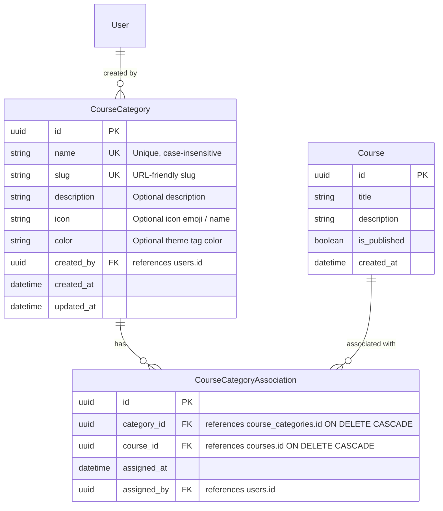

# Data Model: Course Categories Management

**Feature**: `001-course-categories`  
**Date**: 2026-09-11  
**Spec Reference**: [spec.md](file:///Users/anilvattam/.gemini/antigravity-ide/scratch/lms-platform/specs/001-course-categories/spec.md)

## Entity Relationship Diagram

## Entities Specification

### 1. `CourseCategory` (`course_categories` table)

| Column | Type | Constraints | Description |
|---|---|---|---|
| `id` | `UUID` | Primary Key, default `uuid.uuid4()` | Unique identifier for the category |
| `name` | `VARCHAR(255)` | NOT NULL, Unique | Human-readable name of the category (e.g. "Web Development") |
| `slug` | `VARCHAR(255)` | NOT NULL, Unique | URL slug generated from name (e.g. "web-development") |
| `description` | `TEXT` | Nullable | Detailed syllabus/topic description |
| `icon` | `VARCHAR(50)` | Nullable, default `'🏷️'` | Category visual indicator / emoji |
| `color` | `VARCHAR(50)` | Nullable, default `'#6366f1'` | Accent badge color |
| `created_by` | `UUID` | Foreign Key (`users.id`), Nullable | Admin user who created the category |
| `created_at` | `TIMESTAMP WITH TIME ZONE` | Server Default `func.now()` | Record creation timestamp |
| `updated_at` | `TIMESTAMP WITH TIME ZONE` | Server Default `func.now()`, on update `func.now()` | Record update timestamp |

**Relationships**:
- `courses`: Many-to-many relationship with `Course` through `CourseCategoryAssociation`.
- `creator`: Many-to-one relationship with `User`.

---

### 2. `CourseCategoryAssociation` (`course_category_associations` table)

| Column | Type | Constraints | Description |
|---|---|---|---|
| `id` | `UUID` | Primary Key, default `uuid.uuid4()` | Unique junction record ID |
| `category_id` | `UUID` | Foreign Key (`course_categories.id`, `ON DELETE CASCADE`), NOT NULL | Reference to category |
| `course_id` | `UUID` | Foreign Key (`courses.id`, `ON DELETE CASCADE`), NOT NULL | Reference to course |
| `assigned_at` | `TIMESTAMP WITH TIME ZONE` | Server Default `func.now()` | Assignment timestamp |
| `assigned_by` | `UUID` | Foreign Key (`users.id`), Nullable | Admin who made the assignment |

**Table Constraints**:
- `UniqueConstraint("category_id", "course_id")`: Prevents duplicate associations between the same course and category.

---

## State & Lifecycle Rules

1. **Category Creation**:
   - `name` is trimmed of leading/trailing whitespace. Empty names rejected with HTTP 422.
   - Duplicate names (case-insensitive check) rejected with HTTP 409 Conflict.
2. **Category Deletion**:
   - Deleting a `CourseCategory` triggers database cascade on `course_category_associations`, instantly removing the link rows.
   - `Course` rows remain completely intact; any other category links on the course remain untouched.
3. **Course Deletion**:
   - If a `Course` is deleted, its junction associations are automatically removed via database cascade.
